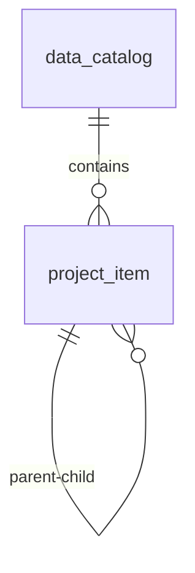

# 数据调度-选择数据 表结构设计

## 1. 目标与范围
本设计用于支撑「新建数据调度 -> 点击选择数据」弹窗场景，覆盖：
- 数据目录（左侧列表）
- 项目列表（右侧树形结构）
- 二者关联关系

不包含任务执行、调度引擎、后端接口实现。

## 2. 实体关系
- 一个数据目录包含多个项目节点（`1:N`）
- 项目节点支持树形父子关系（自关联 `1:N`）

关系示意：

## 3. 表一：`data_catalog`（数据目录表）

| 字段名 | 类型 | 约束 | 说明 |
| --- | --- | --- | --- |
| `id` | BIGINT UNSIGNED | PK, AUTO_INCREMENT | 主键 |
| `catalog_code` | VARCHAR(64) | NOT NULL, UNIQUE | 目录编码（业务唯一） |
| `catalog_name` | VARCHAR(128) | NOT NULL | 目录名称 |
| `catalog_desc` | VARCHAR(255) | NULL | 目录描述 |
| `status` | TINYINT | NOT NULL DEFAULT 1 | 状态：1启用/0禁用 |
| `sort_order` | INT | NOT NULL DEFAULT 0 | 排序值（越小越靠前） |
| `created_by` | BIGINT UNSIGNED | NULL | 创建人 |
| `updated_by` | BIGINT UNSIGNED | NULL | 更新人 |
| `created_at` | DATETIME | NOT NULL DEFAULT CURRENT_TIMESTAMP | 创建时间 |
| `updated_at` | DATETIME | NOT NULL DEFAULT CURRENT_TIMESTAMP ON UPDATE CURRENT_TIMESTAMP | 更新时间 |
| `deleted_at` | DATETIME | NULL | 软删除时间 |

建议索引：
- `uk_catalog_code (catalog_code)`
- `idx_catalog_status_sort (status, sort_order)`

## 4. 表二：`project_item`（项目节点表）

> 用于同时存文件夹与文件节点，支持树结构。

| 字段名 | 类型 | 约束 | 说明 |
| --- | --- | --- | --- |
| `id` | BIGINT UNSIGNED | PK, AUTO_INCREMENT | 主键 |
| `catalog_id` | BIGINT UNSIGNED | NOT NULL, FK -> `data_catalog.id` | 所属数据目录 |
| `parent_id` | BIGINT UNSIGNED | NULL, FK -> `project_item.id` | 父节点ID，根节点为空 |
| `item_code` | VARCHAR(64) | NOT NULL | 节点编码（目录内唯一） |
| `item_name` | VARCHAR(255) | NOT NULL | 节点名称 |
| `item_type` | ENUM('folder','file') | NOT NULL | 节点类型 |
| `file_ext` | VARCHAR(16) | NULL | 文件扩展名（文件节点使用） |
| `file_size_bytes` | BIGINT UNSIGNED | NULL | 文件大小字节（文件节点使用） |
| `item_count` | INT | NULL | 子项数（文件夹节点可冗余存储） |
| `sort_order` | INT | NOT NULL DEFAULT 0 | 同级排序 |
| `status` | TINYINT | NOT NULL DEFAULT 1 | 状态：1启用/0禁用 |
| `created_by` | BIGINT UNSIGNED | NULL | 创建人 |
| `updated_by` | BIGINT UNSIGNED | NULL | 更新人 |
| `created_at` | DATETIME | NOT NULL DEFAULT CURRENT_TIMESTAMP | 创建时间 |
| `updated_at` | DATETIME | NOT NULL DEFAULT CURRENT_TIMESTAMP ON UPDATE CURRENT_TIMESTAMP | 更新时间 |
| `deleted_at` | DATETIME | NULL | 软删除时间 |

建议索引：
- `uk_catalog_item_code (catalog_id, item_code)`
- `idx_catalog_parent_sort (catalog_id, parent_id, sort_order)`
- `idx_catalog_type (catalog_id, item_type)`

## 5. 关键约束
- `project_item.catalog_id` 必须存在于 `data_catalog.id`
- `project_item.parent_id` 为空时表示根节点
- `project_item.parent_id` 不为空时，父节点与子节点必须在同一 `catalog_id` 下
- `item_type='folder'` 时，`file_ext/file_size_bytes` 应为空
- `item_type='file'` 时，建议至少有 `file_ext` 或 `file_size_bytes`

## 6. 查询建议（对应弹窗）
1. 左侧目录列表：
- 按 `status=1`、`sort_order asc` 查询 `data_catalog`

2. 右侧项目树：
- 根据 `catalog_id` 查询 `project_item`
- 按 `parent_id + sort_order` 组装树结构

## 7. 前端字段映射建议
- 左侧目录卡片：`catalog_name`、`catalog_desc`
- 右侧树节点标题：`item_name`
- 右侧灰色信息：
  - 文件夹：`item_type='folder'` + `item_count`
  - 文件：`item_type='file'` + `file_ext` + `file_size_bytes`

## 8. 预留扩展（非本次必做）
如果后续要保存“某次新建任务选中了哪些项目”，可新增关联表：
- `schedule_task`
- `schedule_task_item_rel(task_id, project_item_id)`
